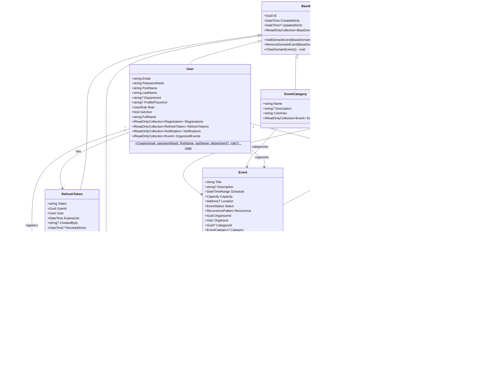

# Class Diagrams

## 1. Domain Layer — Entities & Value Objects

## 2. Domain Layer — Enums, Events & Exceptions

```mermaid
classDiagram
    direction TB

    class EventStatus {
        <<enumeration>>
        Draft = 0
        Published = 1
        Cancelled = 2
        Completed = 3
    }

    class UserRole {
        <<enumeration>>
        Employee = 0
        Organizer = 1
        Admin = 2
    }

    class RegistrationStatus {
        <<enumeration>>
        Pending = 0
        Confirmed = 1
        Cancelled = 2
        Waitlisted = 3
    }

    class NotificationType {
        <<enumeration>>
        EventCreated = 0
        EventUpdated = 1
        EventCancelled = 2
        RegistrationConfirmed = 3
        RegistrationCancelled = 4
        Reminder = 5
        Waitlisted = 6
        PromotedFromWaitlist = 7
    }

    class RecurrencePattern {
        <<enumeration>>
        None = 0
        Daily = 1
        Weekly = 2
        Monthly = 3
    }

    class BaseDomainEvent {
        <<abstract>>
        +DateTime OccurredOnUtc
    }
    class INotification {
        <<interface>>
    }

    class EventCreatedDomainEvent {
        +Guid EventId
        +string Title
    }
    class EventCancelledDomainEvent {
        +Guid EventId
        +string Title
    }
    class UserRegisteredDomainEvent {
        +Guid UserId
        +Guid EventId
        +RegistrationStatus Status
    }
    class RegistrationConfirmedDomainEvent {
        +Guid UserId
        +Guid EventId
    }
    class RegistrationCancelledDomainEvent {
        +Guid UserId
        +Guid EventId
    }

    INotification <|.. BaseDomainEvent
    BaseDomainEvent <|-- EventCreatedDomainEvent
    BaseDomainEvent <|-- EventCancelledDomainEvent
    BaseDomainEvent <|-- UserRegisteredDomainEvent
    BaseDomainEvent <|-- RegistrationConfirmedDomainEvent
    BaseDomainEvent <|-- RegistrationCancelledDomainEvent

    class DomainException {
        +DomainException(string message)
        +DomainException(string message, Exception inner)
    }
    class NotFoundException {
        +NotFoundException(string name, object key)
    }
    class ForbiddenException {
        +ForbiddenException(string message?)
    }
    class ValidationException {
        +IDictionary~string, string[]~ Errors
        +ValidationException()
        +ValidationException(IEnumerable~ValidationFailure~ failures)
    }

    Exception <|-- DomainException
    Exception <|-- NotFoundException
    Exception <|-- ForbiddenException
    Exception <|-- ValidationException
```

## 3. Domain Layer — Repository Interfaces

## 4. Application Layer — Service Interfaces & Models

## 5. Application Layer — DTOs

## 6. Application Layer — CQRS: Auth Feature

## 7. Application Layer — CQRS: Events Feature

## 8. Application Layer — CQRS: Registrations, Notifications, Venues & Reports

## 9. Application Layer — Domain Event Handlers

## 10. Persistence Layer — Repositories & DbContext

## 11. Infrastructure Layer — Services

## 12. API Layer — Controllers & Middleware

## 13. Architecture Overview — Layer Dependencies

