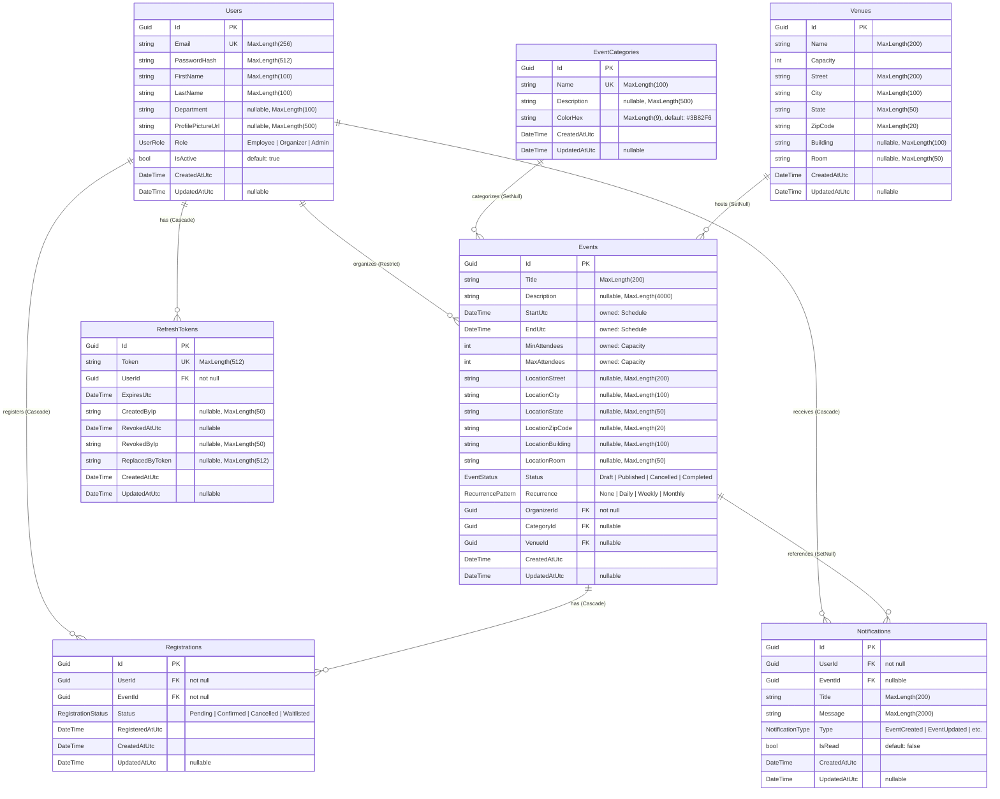
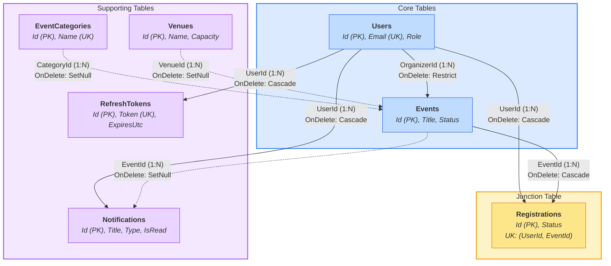

# Database Diagram

## Relationship Diagram

> **Solid arrows** (`-->`) represent required FK relationships with `Cascade` or `Restrict` delete.
> **Dashed arrows** (`-.->`) represent optional/nullable FK relationships with `SetNull` delete.
> Arrow direction points from the parent (one) to the child (many).

## Relationships

| From | To | Type | FK Column | On Delete |
|---|---|---|---|---|
| Users | Events | One-to-Many | Events.OrganizerId | Restrict |
| Users | Registrations | One-to-Many | Registrations.UserId | Cascade |
| Users | Notifications | One-to-Many | Notifications.UserId | Cascade |
| Users | RefreshTokens | One-to-Many | RefreshTokens.UserId | Cascade |
| Events | Registrations | One-to-Many | Registrations.EventId | Cascade |
| Events | Notifications | One-to-Many | Notifications.EventId | SetNull |
| EventCategories | Events | One-to-Many | Events.CategoryId | SetNull |
| Venues | Events | One-to-Many | Events.VenueId | SetNull |

## Unique Constraints

| Table | Column(s) |
|---|---|
| Users | Email |
| EventCategories | Name |
| RefreshTokens | Token |
| Registrations | (UserId, EventId) composite |

## Owned Value Objects

| Owner | Property | Value Object | Embedded Columns |
|---|---|---|---|
| Events | Schedule | DateTimeRange | StartUtc, EndUtc |
| Events | Capacity | Capacity | MinAttendees, MaxAttendees |
| Events | Location | Address | LocationStreet, LocationCity, LocationState, LocationZipCode, LocationBuilding, LocationRoom |
| Venues | Address | Address | Street, City, State, ZipCode, Building, Room |

## Enums (stored as strings, MaxLength 20-30)

| Enum | Values |
|---|---|
| UserRole | Employee (0), Organizer (1), Admin (2) |
| EventStatus | Draft (0), Published (1), Cancelled (2), Completed (3) |
| RegistrationStatus | Pending (0), Confirmed (1), Cancelled (2), Waitlisted (3) |
| RecurrencePattern | None (0), Daily (1), Weekly (2), Monthly (3) |
| NotificationType | EventCreated (0), EventUpdated (1), EventCancelled (2), RegistrationConfirmed (3), RegistrationCancelled (4), Reminder (5), Waitlisted (6), PromotedFromWaitlist (7) |
