# Sequence Diagrams

## 1. User Registration

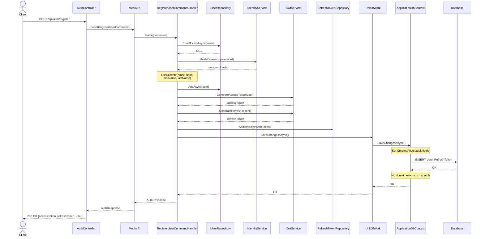

## 2. User Login

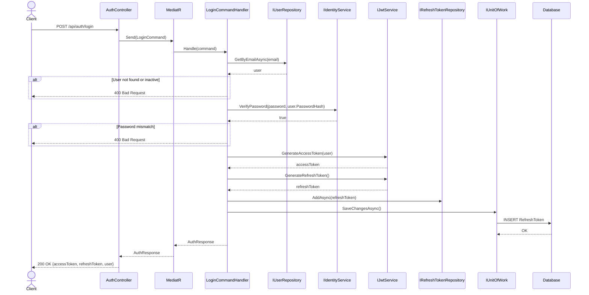

## 3. Token Refresh

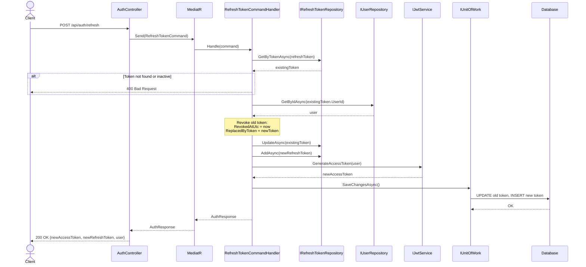

## 4. Create Event (Draft)

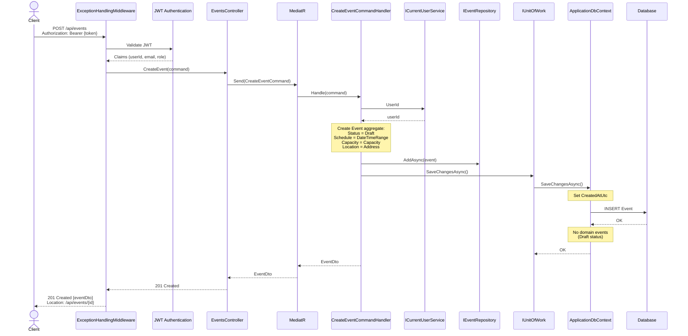

## 5. Publish Event (with real-time notification)

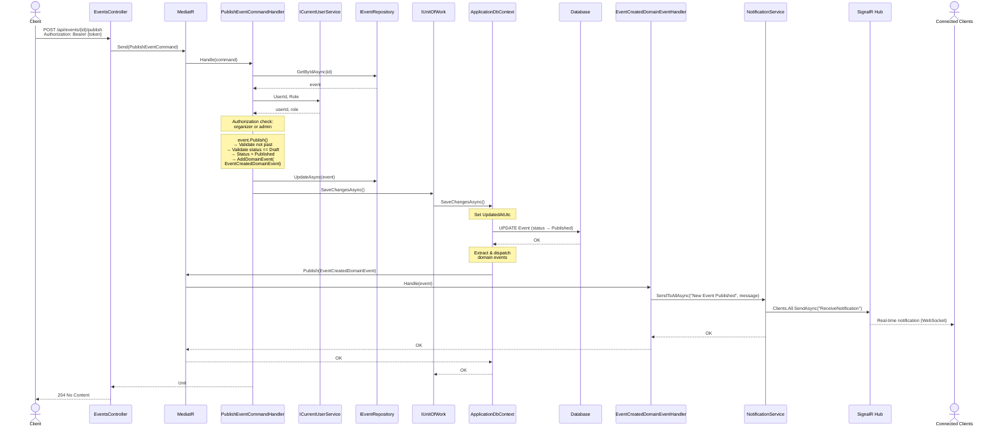

## 6. Cancel Event (with real-time notification)

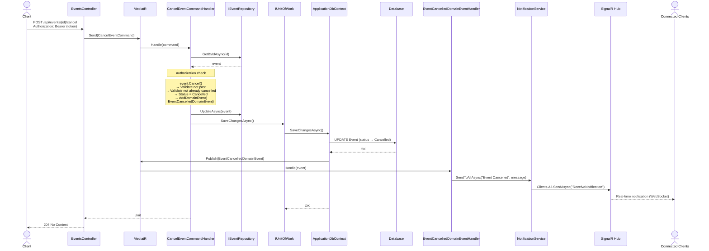

## 7. Register for Event (with targeted notification)

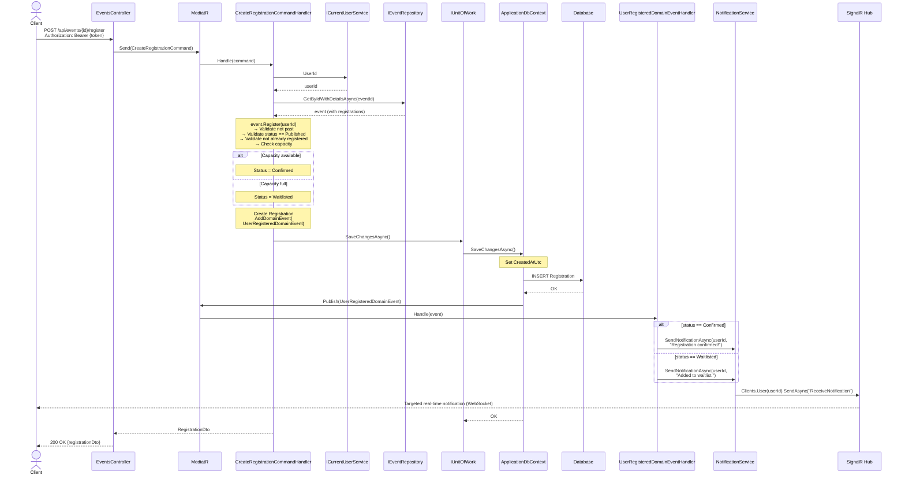

## 8. Cancel Registration

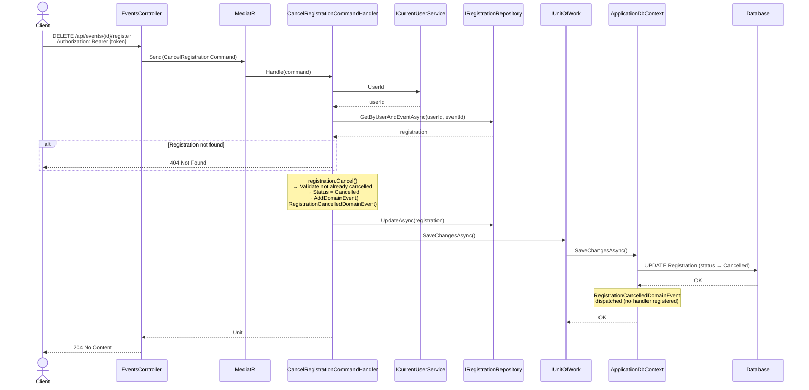

## 9. View Event (with auto-complete for past events)

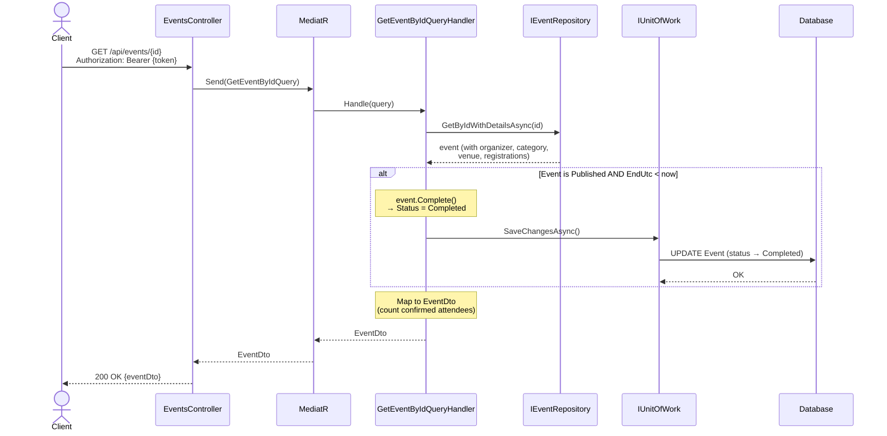

## 10. Error Handling Flow

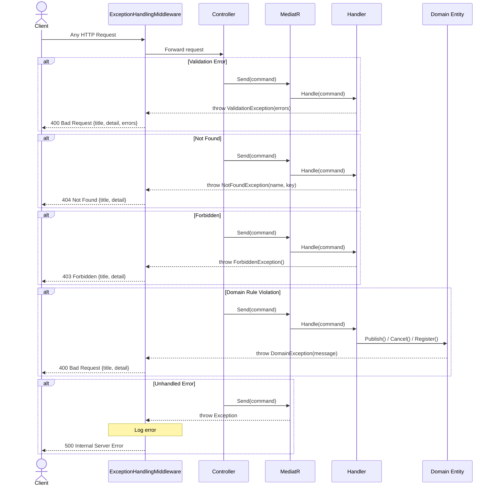

## 11. SignalR Connection Lifecycle

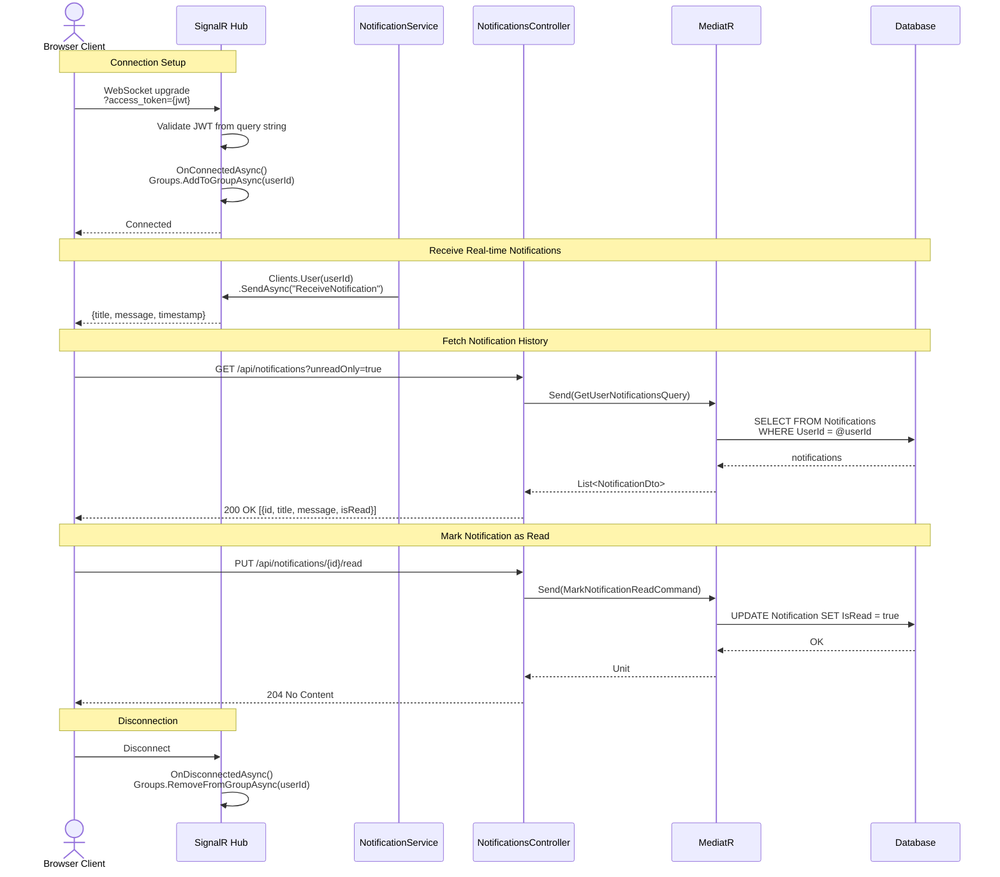

## 12. Complete Event Lifecycle

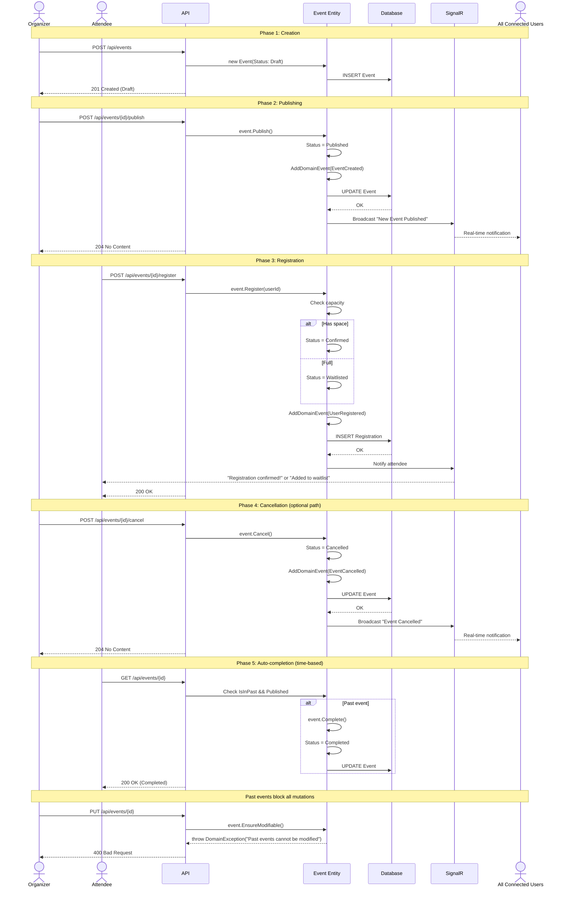
